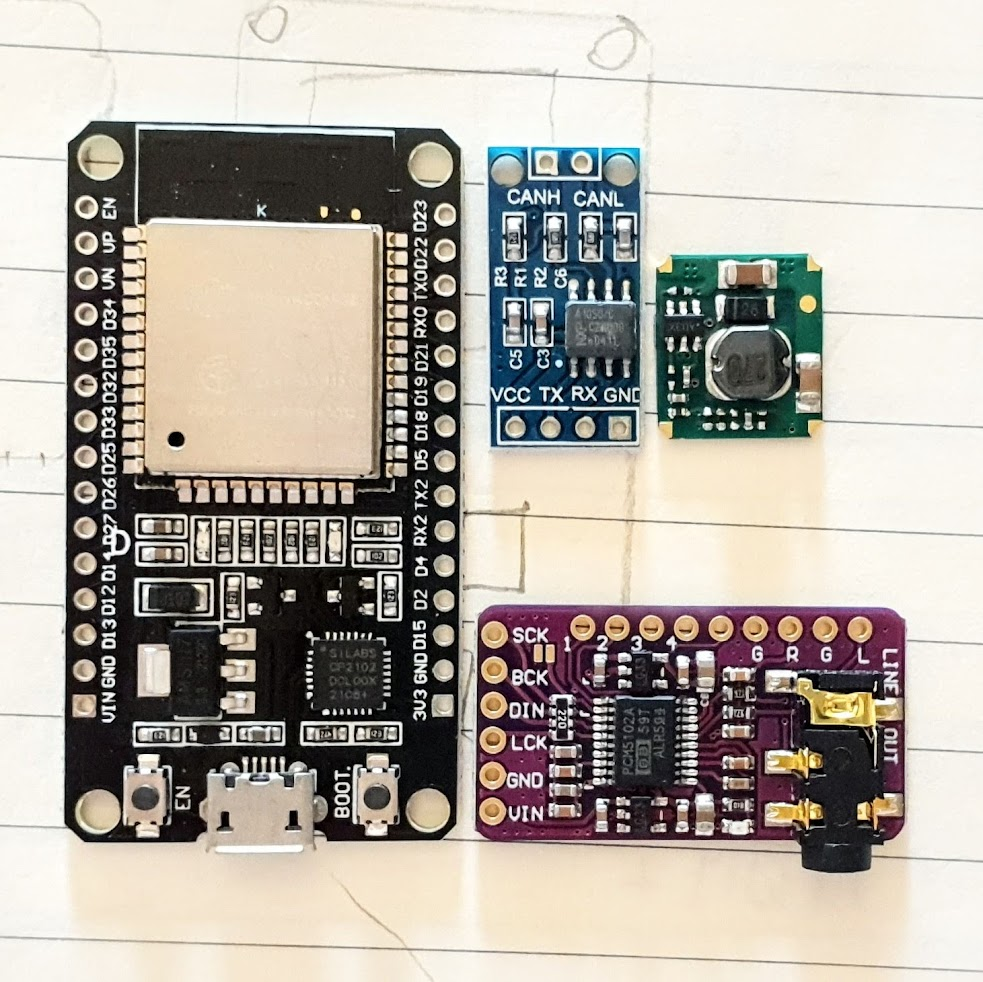

# saab-93NG-bluetooth-aux
## (development branch)
A module to augment the Aux-In functionality of SAAB 93NG's (2002/3+), to add Bluetooth media playback and steering wheel media control support.

# Development branch goals
- All the features of the master branch, but using alternative hardware modules.
- Key hardware change involved using the internal CAN controller of the ESP32, with only a CAN transceiver module needed externally.
- Implementation of the master branch features, but using the ESP-IDF library exclusively. This avoids the weird Arduino<->ESP-IDF translation and version control issues, and we get the benefits of FreeRTOS.

# Hardware
 - `ESP32` NodeMCU Development Board, **30-pin variant** (same as master branch)
 - `PCM5102` DAC Module
 - `TJA1050` CAN Transceiver Module
 - `VXO7805-500-M-TR DC-DC` 12V -> 5V Power Supply Module. 
   - This is in a ***4-SMD Module*** package, of which there are plenty alternatives to choose from.

# Note on using TJA1050 Module with 3.3V
The TJA1050 module is designed to run at 5V, however I have done conclusive tests to show that it is very capable of running at 3.3V.

To avoid damaging the 3.3V-rated pins of the ESP32 chip, a white LED was used in series from the RX-output pin of the TJA1050 module, which dropped about 2V. This was tested to work up to speeds of 1Mbit.

# Project Layout
- /esp32_a2dp_reciever  
  - The original PlatformIO project, modified to work with a PCM5102 DAC module.
- /esp_idf_twai_self_test
  - An ESP-IDF based project, that tests the Two Wire Automotive Interface (CAN) controller. It is designed to run in loopback mode, so only a single transceiver is needed.
- /esp_idf_a2dp_receiver
  - Attempt to build a bluetooth audio receiver with all the functionality of the master branch, 
